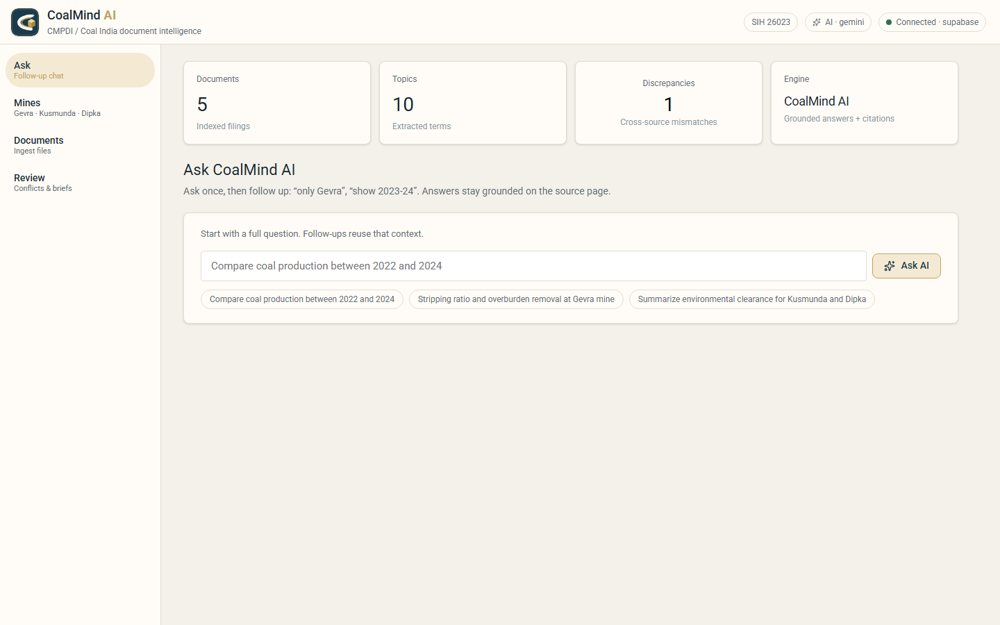
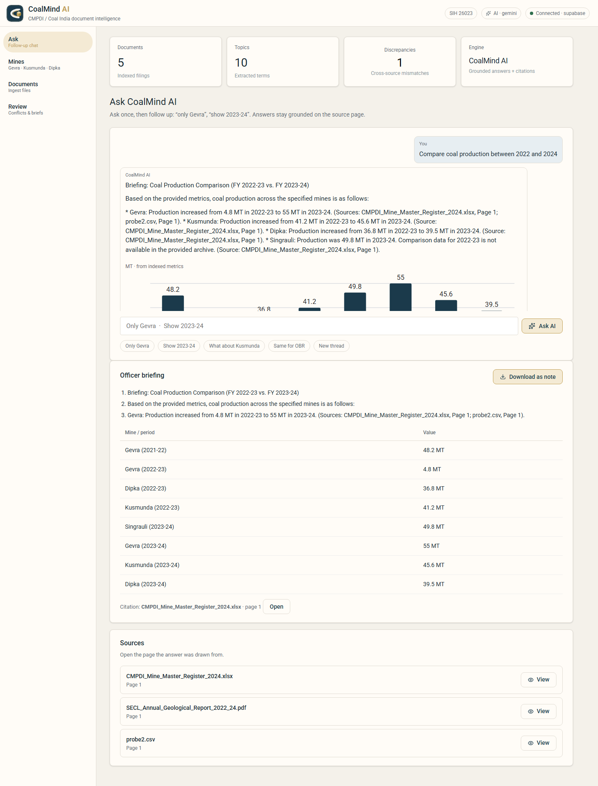
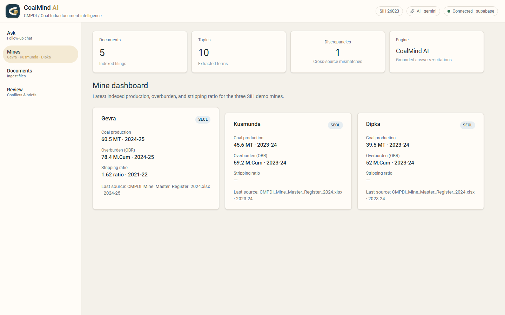
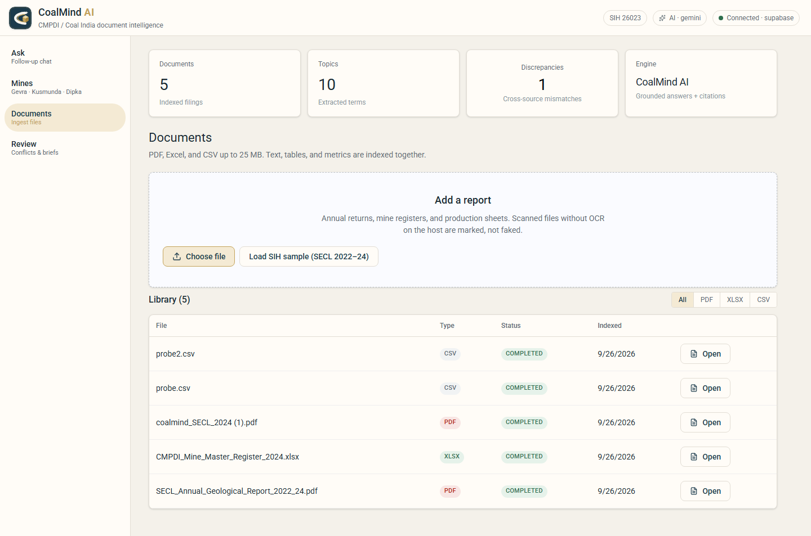
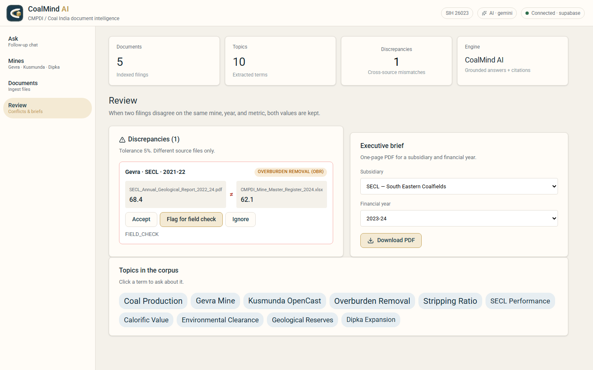

# CoalMind AI — Prototype Report

**Smart India Hackathon 2025 · Problem SIH 26023**  
AI-Powered Geological, Mining and other Reporting Solution for CMPDI / CIL subsidiaries  

**Team:** AGNIVAULT  
**Product:** CoalMind AI  
**Live demo (read-only):** https://2410305056-tech.github.io/coalmind-ai/  
**Local prototype:** http://127.0.0.1:5173 (UI) · http://127.0.0.1:8000 (API)  
**Captured:** 26 September 2026, working stack with Gemini + Supabase  

---

## 1. Problem

CMPDI and Coal India subsidiaries produce large volumes of PDFs, mine registers, and spreadsheets. Officers still:

- re-type figures into briefs,
- lose the page a number came from,
- miss when two filings disagree on the same mine and year.

The SIH statement asks for an **AI reporting copilot** that extracts, retrieves, verifies, and reports — not a chatbot that invents tonnes.

---

## 2. What the prototype is

CoalMind AI is a **document intelligence console**:

**Upload → Extract → Store → Ask AI → Cite the page → Flag conflicts → Download a brief.**

It is built to run on a normal laptop (no CUDA, no torch, no FAISS). Gemini is used only as a language layer **on top of indexed archive rows**.

| Jury metric (this capture) | Value |
|---|---|
| Indexed filings | 5 |
| Topic terms | 10 |
| Cross-source discrepancies | 1 |
| Engine | CoalMind AI · Gemini |
| Store | Supabase |

---

## 3. How it works

```text
PDF / XLSX / CSV
        │
        ▼
 Parser (pypdf / pandas) ──► text chunks + mine/year/parameter metrics
        │
        ▼
 Store (Supabase or SQLite)
        │
        ├── SQL path:  structured metrics  →  chart + briefing
        ├── RAG path:  hashed 384-d search →  cited passages
        └── Conflict scan: same mine + year + metric, two sources, >5% gap
        │
        ▼
 Gemini (optional) writes English from those facts only
        │
        ▼
 Officer briefing note  ·  source viewer  ·  one-page PDF
```

**Grounding rule:** if the archive has no row, the answer says so. Numbers in the briefing come from ingested files (for example `CMPDI_Mine_Master_Register_2024.xlsx`), not from the model’s memory.

**Follow-ups:** a short chip such as “Only Gevra” is expanded to the previous question plus that constraint, then re-run on the same store.

---

## 4. Architecture (what actually ships)

| Layer | Choice | Why |
|---|---|---|
| UI | React + Vite | Light console, localhost:5173 |
| API | FastAPI · port 8000 | Upload, query, PDF, demo pack |
| Extract | pypdf, pandas, regex | Laptop-safe; no Tesseract fakes OCR |
| Vectors | hashed / SVD 384-d | No sentence-transformers |
| LLM | Gemini (`gemini-3.8-flash`) via httpx | Optional; falls back to grounded extractive text |
| Data | Supabase Postgres (anon read on Pages) | SQLite if cloud keys missing |
| Hosted UI | GitHub Pages | Read-only Ask / library / conflicts |

**Not used (on purpose):** LangChain, FAISS, Qdrant, PyTorch, Next.js, Railway.

---

## 5. Prototype walkthrough (screenshots)

### 5.1 Console home — Ask

Light CMPDI palette, project mark (cream **C** + gold coal crystal + AI spark), chips **SIH 26023**, **AI · gemini**, **Connected · supabase**.

The officer starts with a full question. Suggested prompts match the SIH demo: production compare, Gevra OBR/stripping, Kusmunda/Dipka environmental clearance.



**What this screen proves:** the prototype is a working console, not a slide. Health, document count, and Gemini are live.

---

### 5.2 Ask working — cited AI answer

Question used: *Compare coal production between 2022 and 2024*.

The thread shows:

1. Gemini briefing with mine-wise figures and **source file + page**.
2. Bar chart from indexed metrics (not invented series).
3. **Officer briefing** card: 3 bullets, figures table, one citation, **Download as note**.
4. **Sources** with View (opens the cited filing).



**What this screen proves:** RAG/SQL + LLM stay tied to `CMPDI_Mine_Master_Register_2024.xlsx` / sample PDF. Follow-up chips (*Only Gevra*, *Show 2023-24*) appear after the first turn so the officer does not retype the whole question.

---

### 5.3 Mine dashboard

One screenshot for the jury: Gevra, Kusmunda, Dipka — latest production, OBR, stripping ratio, last source file.



| Mine | Production (this capture) | OBR | Source |
|---|---|---|---|
| Gevra | 60.5 MT · 2024-25 | 78.4 M.Cum | Mine master register |
| Kusmunda | 45.6 MT · 2023-24 | 59.2 M.Cum | Mine master register |
| Dipka | 39.5 MT · 2023-24 | 52.0 M.Cum | Mine master register |

---

### 5.4 Documents — ingest + SIH sample pack

PDF / Excel / CSV up to 25 MB. **Load SIH sample (SECL 2022–24)** seeds the two official demo files so the stage demo does not depend on browsing a USB stick.

Library in this capture:

- `SECL_Annual_Geological_Report_2022_24.pdf`
- `CMPDI_Mine_Master_Register_2024.xlsx`
- additional PDF/CSV used during local testing

Status **completed** means text + metrics were indexed. Scanned PDFs without OCR on the host are marked `ocr_unavailable` instead of hallucinating text.



---

### 5.5 Review — conflict control room + PDF brief

Same mine, year, and metric in two files, gap above 5%:

- Gevra · SECL · 2021-22 · Overburden Removal  
- PDF: **68.4** vs register: **62.1**

Officer actions: **Accept** / **Flag for field check** / **Ignore**, with timestamp. This capture shows **FIELD_CHECK** (gold).

Right panel: one-page **executive PDF** for a subsidiary and FY (ReportLab).



**What this screen proves:** the system does not silently pick one number. Both values stay visible until an officer records a decision.

---

## 6. Jury demo script (≈5 minutes)

1. Open http://127.0.0.1:5173 — point to **AI · gemini** and 5 documents.  
2. **Documents → Load SIH sample** if the library is empty.  
3. **Ask:** “Compare coal production between 2022 and 2024.”  
4. Show chart + **Download as note**.  
5. Follow-up chip **Only Gevra**.  
6. **Mines** screenshot (three tiles).  
7. **Review:** Gevra OBR 68.4 ≠ 62.1 → Flag for field check.  
8. **Download PDF** for SECL 2023-24.

---

## 7. Feature map vs SIH need

| Need | Prototype |
|---|---|
| Ingest mining reports | PDF, XLSX, CSV upload + SIH sample pack |
| Extract tables / narrative | Parser → chunks + metrics |
| Natural-language Q&A | Ask thread + Gemini / grounded fallback |
| Traceability | Source list, page, View / citation |
| Analytics | SQL intent + bar chart + mine tiles |
| Data integrity | Conflict detector + officer workflow |
| Report out | Officer .txt note + executive PDF |
| Hosted peek | GitHub Pages + Supabase anon read |

---

## 8. Run the prototype

API (project root, `PYTHONPATH` = this folder):

```text
python -m uvicorn backend.main:app --host 127.0.0.1 --port 8000
```

UI:

```text
cd frontend
npm install
npm run dev
```

Open http://127.0.0.1:5173 (Vite proxies `/api` and `/health` to port 8000).

Optional `.env` (never commit): `STORE_TYPE=supabase`, `GEMINI_API_KEY`, Supabase URL + service role.

Hosted UI is read-only: Ask / library / conflicts work; upload and PDF need the local API.

---

## 9. Honest limits

- No GPU OCR: scanned pages without text are labelled, not guessed.  
- Embeddings are hashed/SVD, not a large embedding model.  
- GitHub Pages cannot ingest new files (no FastAPI).  
- Gemini is optional; without a key, answers stay extractive but still cited.  
- Roles are not a full IAM system (officer actions are logged on the conflict row).

These are deliberate so the demo stays up on an 8 GB laptop.

---

## 10. Conclusion

The prototype is a **working CMPDI-style console**: live Gemini answers, cited metrics, a three-mine dashboard, a one-click SECL sample pack, and a conflict that must be accepted or sent for field check. That is the product story for SIH 26023 — **reports you can audit**, not free-form generation.

**Repository:** https://github.com/2410305056-tech/coalmind-ai  

Screenshot files (this folder):

- `screenshots/01-ask-home.png`
- `screenshots/02-ask-working.png`
- `screenshots/03-ask-followup.png`
- `screenshots/04-mines.png`
- `screenshots/05-documents.png`
- `screenshots/06-review.png`
